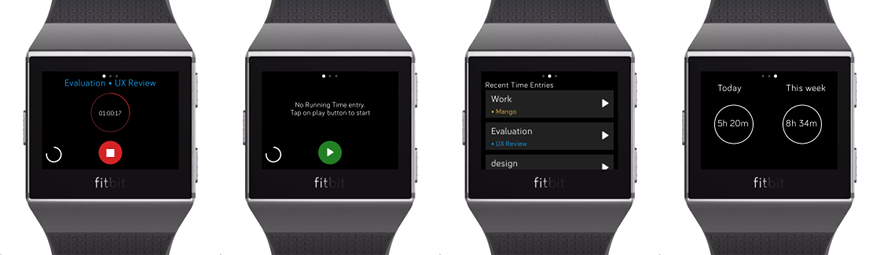

<h1 align="center">
  <a href="https://toggl.com">Tracks</a>
</h1>

<h4 align="center">(Unofficial) Simple Fitbit app for <a href="https://toggl.com" target="_blank">Toggl Track</a>.</h4>


<p align="center">
  <a href="#about">About</a> •
  <a href="#download">Download</a> •
  <a href="#build">Build</a> •
  <a href="#origins">Origins</a>
</p>

# About

  **Tracks** is a time tracking client for the smartwatch Fitbit. It holds only the most simple functionality and let's the user start and stop time entries fast from their wrist.

<br/>
<br/>
<br/>

<br/>
<br/>
<br/>

# Download

Version for newer Fitbits (Versa 3 and Sense). Get it from Fitbit Gallery <a href="https://gallery.fitbit.com/details/e9a744a6-414d-4976-9823-6ddb484ac3ae">here</a>.

Version for older Fitbits with app name Togglbit. Get it from Fitbit Gallery <a href="https://gallery.fitbit.com/details/70dfd461-bbb7-42a6-968f-1a5a72076eb8">here</a>.

# Build

## Setup Fitbit CLI

#### Install node and npm

Get latest node package from <a href="https://nodejs.org/en/download/">here</a>.

#### Install Fitbit tools (SDK and CLI)

- Open up terminal

- Run command to install SDK
```
npm add --dev @fitbit/sdk
```

- Run command to install CLI
```
npm add --dev @fitbit/sdk-cli
```

## Setup Fitbit OS Simulator

<p>The simulator is available as a download for
<a href="https://simulator-updates.fitbit.com/download/latest/win">Windows</a> or
<a href="https://simulator-updates.fitbit.com/download/latest/mac">macOS</a>.</p>


## Build and run the app

- Open up Fitbit OS Simulator
- Open terminal and go to the project root path
- Execute `npx fitbit` to jump into Fitbit console _(It will ask you to log in to your fitbit account if you are not logged in)_
- Execute `build-and-install` in Fitbit console to build and run the app.

## Origins

Originally created by Indrek Vändrik in 1 week during a Go Loco Week at Toggl - <a href="https://toggl.com/blog/the-desktop-teams-go-loco-week">Blog post about Go Loco Week</a>.
The original repo is at https://github.com/toggl/togglbit